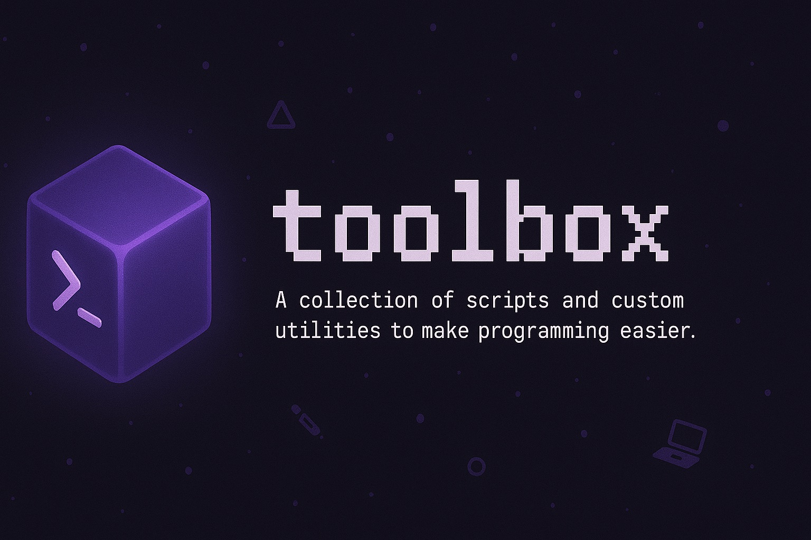

# toolbox - A collection of scripts and custom utilities to make programming easier

This repository contains some scripts and self written utilities, which I use in my daily coding tasks in order to make life easier for myself. These include:

- C++
    - Docker++ (A docker environment for building C++ projects using CMake [and soon vcpkg])
    - Project Init (A script for scaffolding a basic CMake project with vcpkg [vcpkg coming soon])
- VimUp (A script which replicates my vim setup using Vim8 plugins)